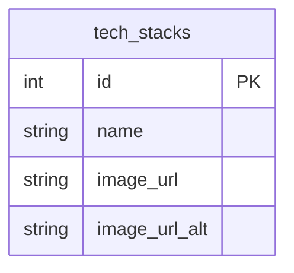

# Database Design

## ER Diagram

## Tables Explanation

### tech_stacks

What technology is being used in a project. Created so that we could add functionality like filtering projects that use a particular technology. There are 2 image URLs because I want to add a feature to toggle between the professional logo and the cute v-tuber inspired one. I just found it to be extremely neat.
