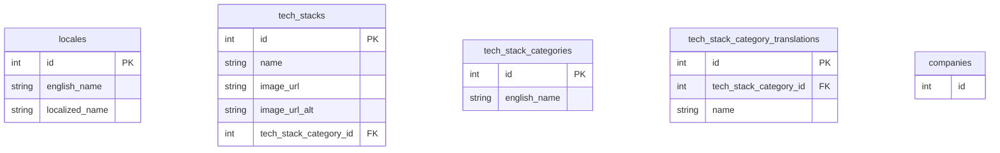

# Database Design

## ER Diagram

## Tables Explanation

### locales

What locales are being supported by this project. This is made because I want to make it so that I can cast the widest net. Japanese because I currently live in Japan, English so that I could work at an international company, Indonesian for when I need to work back in the motherland.

### tech_stacks

What technology is being used in a project. Created so that we could add functionality like filtering projects that use a particular technology. There are 2 image URLs because I want to add a feature to toggle between the professional logo and the cute v-tuber inspired one. I just found it to be extremely neat.

### tech_stack_categories

How to classify the tech-stack. This is is so that we could add feature that group tech-stacks based on their similarity.

### tech_stack_category_translations

Translation table for [tech_stack_categories](#tech_stack_category_translations).
