# Entity Relationships

## ER Diagram

```mermaid

erDiagram

    locales {
        int     id              PK
        string  english_name
        string  localized_name
        string  code
    }

    tech_stacks {
        int     id                      PK
        string  name
        string  image_url
        string  image_url_alt
        int     tech_stack_category_id  FK
    }

    tech_stack_categories {
        int     id              PK
        string  english_name
    }

    tech_stack_category_translations  {
        int     id                      PK
        int     tech_stack_category_id  FK
        int     locale_id               FK
        string  name
    }

    companies {
        int     id              PK
        string  english_name
    }

    company_translations {
        int     id          PK
        string  name
        string  description
        int     locale_id   FK
        int     company_id  FK
    }

    locations {
        int     id              PK
        string  english_country
        string  english_province
        string  english_city
    }

    location_translations {
        int     id          PK
        string  country
        string  province
        string  city
        int     location_id FK
        int     locale_id   FK
    }

    work_modes {
        int     id              PK
        string  english_name
    }

    work_mode_translations {
        int     id              PK
        string  name
        int     work_mode_id    FK
        int     locale_id       FK
    }

    projects {
        int     id              PK
        string  english_name
        bool    is_personal
    }

    project_translations {
        int     id          PK
        string  name
        string  description
        int     project_id  FK
        int     locale_id   FK
    }

    employment_types {
        int     id              PK
        string  english_name
    }

    employment_type_translations {
        int     id                  PK
        string  name
        int     employment_type_id  FK
        int     locale_id           FK
    }

    work_experiences {
        int     id                  PK
        int     company_id          FK
        date    start_date
        date    end_date
        int     employment_type_id  FK
        int     work_mode_id        FK
    }

    work_experience_translations {
        int     id                  PK
        string  position_title
        string  description
        int     work_experience_id  FK
        int     locale_id           FK
    }

    project_tech_stacks {
        int     id              PK
        int     project_id      FK
        int     tech_stack_id   FK
    }

    work_experience_tech_stacks {
        int     id                  PK
        int     work_experience_id  FK
        int     tech_stack_id       FK
    }

    work_experience_projects {
        int     id                  PK
        int     work_experience_id  FK
        int     project_id          FK
    }

    work_experience_locations {
        int     id                  PK
        int     work_experience_id  FK
        int     location_id         FK
    }

    work_experience_locales {
        int     id                  PK
        int     work_experience_id  FK
        int     locale_id           FK
    }

    %% Relationships

    %% Tech stack relationships
    tech_stack_categories ||--o{ tech_stacks : "categorizes"
    tech_stack_categories ||--o{ tech_stack_category_translations : "has"
    locales ||--o{ tech_stack_category_translations : "translates"

    %% Company relationships
    companies ||--o{ company_translations : "has"
    locales ||--o{ company_translations : "translates"
    companies ||--o{ work_experiences : "employs"

    %% Location relationships
    locations ||--o{ location_translations : "has"
    locales ||--o{ location_translations : "translates"

    %% Work mode relationships
    work_modes ||--o{ work_mode_translations : "has"
    locales ||--o{ work_mode_translations : "translates"
    work_modes ||--o{ work_experiences : "describes"

    %% Project relationships
    projects ||--o{ project_translations : "has"
    locales ||--o{ project_translations : "translates"

    %% Employment type relationships
    employment_types ||--o{ employment_type_translations : "has"
    locales ||--o{ employment_type_translations : "translates"
    employment_types ||--o{ work_experiences : "classifies"

    %% Work experience relationships
    work_experiences ||--o{ work_experience_translations : "has"
    locales ||--o{ work_experience_translations : "translates"

    %% Junction table relationships
    projects ||--o{ project_tech_stacks : "uses"
    tech_stacks ||--o{ project_tech_stacks : "used_in"

    work_experiences ||--o{ work_experience_tech_stacks : "uses"
    tech_stacks ||--o{ work_experience_tech_stacks : "used_in"

    work_experiences ||--o{ work_experience_projects : "includes"
    projects ||--o{ work_experience_projects : "part_of"

    work_experiences ||--o{ work_experience_locations : "located_at"
    locations ||--o{ work_experience_locations : "hosts"

    work_experiences ||--o{ work_experience_locales : "uses"
    locales ||--o{ work_experience_locales : "spoken_in"

```

## Tables Explanation

### locales

What locales are being supported by this project. This is made because I want to make it so that I can cast the widest net. Japanese because I currently live in Japan, English so that I could work at an international company, Indonesian for when I need to work back in the motherland.

### tech_stacks

What technology is being used in a project. Created so that we could add functionality like filtering projects that use a particular technology. There are 2 image URLs because I want to add a feature to toggle between the professional logo and the cute v-tuber inspired one. I just found it to be extremely neat.

### tech_stack_categories

How to classify the tech-stack. This is so that we could add a feature that groups tech-stacks based on their similarity. Examples include Frontend, Backend, DevOps, Database, etc.

### tech_stack_category_translations

Translation table for [tech_stack_categories](#tech_stack_categories). Contains the localized category name for each supported locale.

### companies

Companies that I have worked for. Stores the base company record with an English name for reference and administration.

### company_translations

Translation table for [companies](#companies). Contains the localized company name and description for each supported locale.

### locations

Where I lived during that time period. Stores geographic information at the country, province, and city level in English for reference.

### location_translations

Translation table for [locations](#locations). Contains the localized country, province, and city names for each supported locale.

### work_modes

The physical work arrangement for the position. Examples include Remote, On-site, Hybrid, etc.

### work_mode_translations

Translation table for [work_modes](#work_modes). Contains the localized work mode name for each supported locale.

### projects

What kind of project (both professional and personal) that I have done. The `is_personal` flag distinguishes personal side projects from professional work. Time constraints (start/end dates) are tracked through the associated work experience, not on the project itself, since personal projects don't necessarily have defined time periods.

### project_translations

Translation table for [projects](#projects). Contains the localized project name and description for each supported locale.

### employment_types

The nature of the employment contract. Examples include Full-time, Part-time, Contract, Internship, Freelance, etc.

### employment_type_translations

Translation table for [employment_types](#employment_types). Contains the localized employment type name for each supported locale.

### work_experiences

A record of professional work history. Each entry links to a company, employment type, and work mode, along with the time period of employment. Daily languages used in the role are tracked via the `work_experience_locales` junction table.

### work_experience_translations

Translation table for [work_experiences](#work_experiences). Contains the localized position title and job description for each work experience entry.

### project_tech_stacks

Junction table linking [projects](#projects) and [tech_stacks](#tech_stacks). Allows a project to have multiple technologies and a technology to be used across multiple projects.

### work_experience_tech_stacks

Junction table linking [work_experiences](#work_experiences) and [tech_stacks](#tech_stacks). Tracks which technologies were used in each work experience.

### work_experience_projects

Junction table linking [work_experiences](#work_experiences) and [projects](#projects). Associates projects with the work experiences where they were developed or contributed to.

### work_experience_locations

Junction table linking [work_experiences](#work_experiences) and [locations](#locations). Supports scenarios where a work experience spans multiple locations (e.g., relocation during employment or hybrid arrangements across different offices).

### work_experience_locales

Junction table linking [work_experiences](#work_experiences) and [locales](#locales). Tracks which natural languages were used on a day-to-day basis in each work experience. Reuses the `locales` table to avoid duplicating language data.
